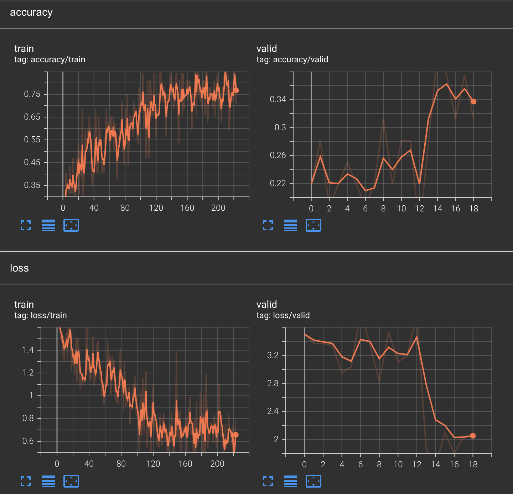
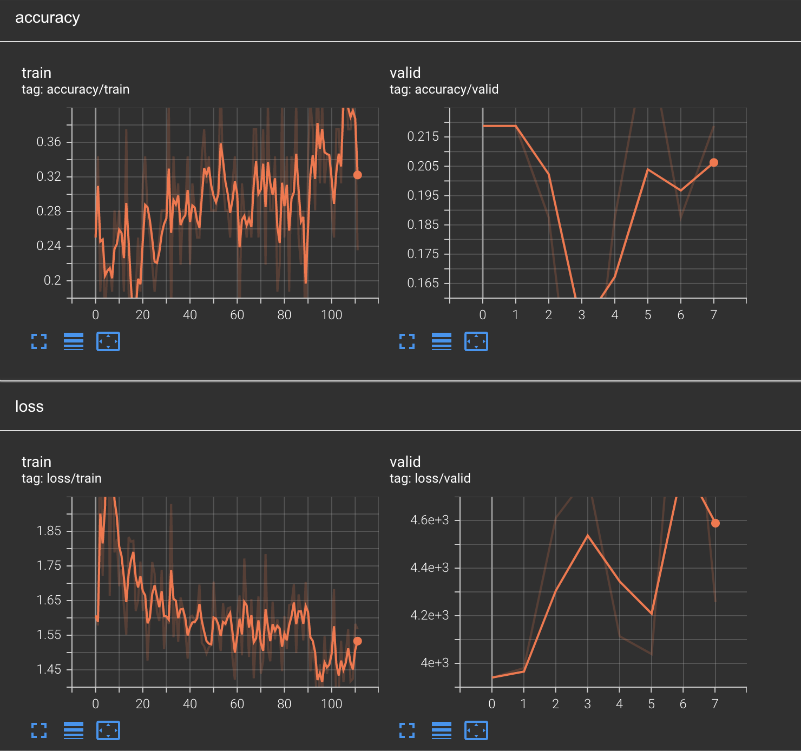

# Face Shape Estimator with PyTorch

<!-- @import "[TOC]" {cmd="toc" depthFrom=1 depthTo=6 orderedList=false} -->

<!-- code_chunk_output -->

- [Face Shape Estimator with PyTorch](#face-shape-estimator-with-pytorch)
  - [Introduction](#introduction)
  - [Requirements](#requirements)
  - [Dataset](#dataset)
    - [Kaggle Face Shape Dataset](#kaggle-face-shape-dataset)
    - [Preprocessing dataset](#preprocessing-dataset)
  - [Model](#model)
    - [Pretrained Efficientnet b7](#pretrained-efficientnet-b7)
  - [Training Result](#training-result)
    - [Model 1](#model-1)
      - [Hyperparameter Setting](#hyperparameter-setting)
      - [Result](#result)
    - [Model 2](#model-2)
      - [Hyperparameter Setting](#hyperparameter-setting-1)
      - [Result](#result-1)
  - [Test Result](#test-result)
    - [Model 1](#model-1-1)
    - [Model 2](#model-2-1)
  - [Folder Structure](#folder-structure)
  - [Usage](#usage)
    - [Config file format](#config-file-format)
    - [Using config files](#using-config-files)
    - [Resuming from checkpoints](#resuming-from-checkpoints)
    - [Testing](#testing)
    - [Tensorboard Visualization](#tensorboard-visualization)
  - [License](#license)
  - [Acknowledgements](#acknowledgements)
  - [References](#references)

<!-- /code_chunk_output -->

## Introduction
This model estimates face shape with 5 classes (Heart, Oblong, Oval, Round, Square).

## Requirements
* Python 3.9.4
* PyTorch 1.12
* tqdm (Optional for `test.py`)
* tensorboard >= 1.14 (see [Tensorboard Visualization](#tensorboard-visualization))
* opencv
* pillow==6.2.1
* pandas
* scikit-learn
* efficientnet-pytorch  

## Dataset
### Kaggle Face Shape Dataset
[https://www.kaggle.com/datasets/niten19/face-shape-dataset](https://www.kaggle.com/datasets/niten19/face-shape-dataset)
### Preprocessing dataset
Crop the face image using face cropper.

[https://github.com/ryuni-dev/face-cropper](https://github.com/ryuni-dev/face-cropper)

## Model
### Pretrained Efficientnet b7
[https://arxiv.org/pdf/1905.11946.pdf](https://arxiv.org/pdf/1905.11946.pdf)
## Training Result
### Model 1
#### Hyperparameter Setting
```
"optimizer": {
    "type": "Adam",
    "args": {
        "lr": 0.001,
        "weight_decay": 0,
        "amsgrad": true
    }
},
"lr_scheduler": {
    "type": "StepLR",
    "args": {
        "step_size": 50,
        "gamma": 0.1
    }
},
```
#### Result


### Model 2
#### Hyperparameter Setting
```
"optimizer": {
    "type": "Adam",
    "args": {
        "lr": 0.005,
        "weight_decay": 0,
        "amsgrad": true
    }
},
"lr_scheduler": {
    "type": "StepLR",
    "args": {
        "step_size": 30,
        "gamma": 0.1
    }
},
```
#### Result


## Test Result
### Model 1
```
{'loss': 0.7550248867599766, 'accuracy': 0.7890466531440162, 'top_k_acc': 0.9675456389452333}
```

### Model 2
```
{'loss': 1.1489163192242202, 'accuracy': 0.6014198782961461, 'top_k_acc': 0.907707910750507}
```

## Folder Structure
  ```
  pytorch-template/
  │
  ├── train.py - main script to start training
  ├── test.py - evaluation of trained model
  │
  ├── config.json - holds configuration for training
  ├── parse_config.py - class to handle config file and cli options
  │
  ├── base/ - abstract base classes
  │   ├── base_data_loader.py
  │   ├── base_model.py
  │   └── base_trainer.py
  │
  ├── data/ - datasets
  │   ├── train.csv - generated by data_loader/split_data.py
  │   ├── val.csv - generated by data_loader/split_data.py
  │   ├── test.csv - generated by data_loader/split_data.py
  │   ├── training_set
  │   └── testing_set
  │
  ├── data_loader/ - anything about data loading goes here
  │   ├── data_loaders.py
  │   └── split_data.py
  │
  ├── data/ - default directory for storing input data
  │
  ├── model/ - models, losses, and metrics
  │   ├── model.py
  │   ├── metric.py
  │   └── loss.py
  │
  ├── saved/
  │   ├── models/ - trained models are saved here
  │   └── log/ - default logdir for tensorboard and logging output
  │
  ├── trainer/ - trainers
  │   └── trainer.py
  │
  ├── logger/ - module for tensorboard visualization and logging
  │   ├── visualization.py
  │   ├── logger.py
  │   └── logger_config.json
  │  
  └── utils/ - small utility functions
      └── util.py
  ```
## Usage
Try `python train.py -c config.json` to run code.

### Config file format
Config files are in `.json` format:
```javascript
{
    "name": "Face Shape - EfficientNet B7",
    "n_gpu": 1,

    "arch": {
        "type": "EffNet",
        "args": {}
    },
    "data_loader": {
        "type": "load_train_data",
        "args":{
            "data_dir": "data/train.csv",
            "batch_size": 16,
            "shuffle": true
        }
    },
    "val_data_loader": {
        "type": "load_val_data",
        "args":{
            "data_dir": "data/val.csv",
            "batch_size": 32,
            "shuffle": false
        }
    },
    "test_data_loader": {
        "type": "load_test_data",
        "args":{
            "data_dir": "data/test.csv",
            "batch_size": 32,
            "shuffle": false
        }
    },
    "optimizer": {
        "type": "Adam",
        "args":{
            "lr": 0.001,
            "weight_decay": 0,
            "amsgrad": true
        }
    },
    "loss": "nll_loss",
    "metrics": [
        "accuracy", "top_k_acc"
    ],
    "lr_scheduler": {
        "type": "StepLR",
        "args": {
            "step_size": 50,
            "gamma": 0.1
        }
    },
    "trainer": {
        "epochs": 20,

        "save_dir": "saved/",
        "save_period": 1,
        "verbosity": 2,
        
        "monitor": "min val_loss",
        "early_stop": 10,

        "tensorboard": true
    }
}
```

### Using config files
Modify the configurations in `.json` config files, then run:

  ```
  python train.py --config config.json
  ```

### Resuming from checkpoints
You can resume from a previously saved checkpoint by:

  ```
  python train.py --resume path/to/checkpoint.pth
  ```

### Testing
```
python test.py --config path/to/config.json --resume path/to/checkpoint.pth
```
### Tensorboard Visualization
This template supports Tensorboard visualization by using either  `torch.utils.tensorboard` or [TensorboardX](https://github.com/lanpa/tensorboardX).

1. **Install**

    If you are using pytorch 1.1 or higher, install tensorboard by 'pip install tensorboard>=1.14.0'.

    Otherwise, you should install tensorboardx. Follow installation guide in [TensorboardX](https://github.com/lanpa/tensorboardX).

2. **Run training** 

    Make sure that `tensorboard` option in the config file is turned on.

    ```
     "tensorboard" : true
    ```

3. **Open Tensorboard server** 

    Type `tensorboard --logdir saved/log/` at the project root, then server will open at `http://localhost:6006`

By default, values of loss and metrics specified in config file, input images, and histogram of model parameters will be logged.
If you need more visualizations, use `add_scalar('tag', data)`, `add_image('tag', image)`, etc in the `trainer._train_epoch` method.
`add_something()` methods in this template are basically wrappers for those of `tensorboardX.SummaryWriter` and `torch.utils.tensorboard.SummaryWriter` modules. 

**Note**: You don't have to specify current steps, since `WriterTensorboard` class defined at `logger/visualization.py` will track current steps.

## License
This project is licensed under the MIT License. See  LICENSE for more details

## Acknowledgements
* Pytorch template generated from [victoresque/pytorch-template](https://github.com/victoresque/pytorch-template)

## References
* [https://www.kaggle.com/code/tqtrinh/face-shape-efficientnetb5-acc-68](https://www.kaggle.com/code/tqtrinh/face-shape-efficientnetb5-acc-68)